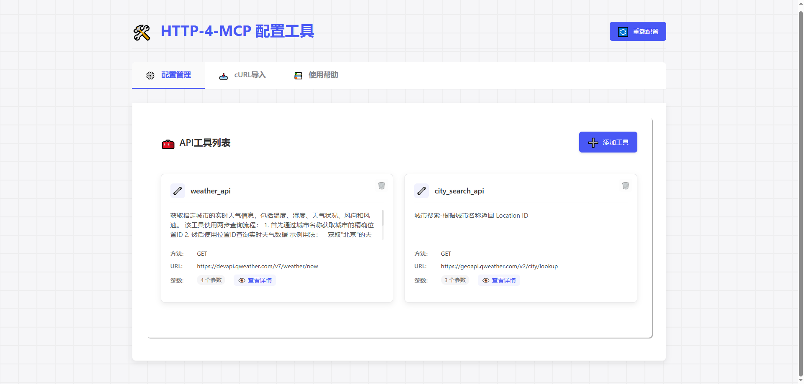
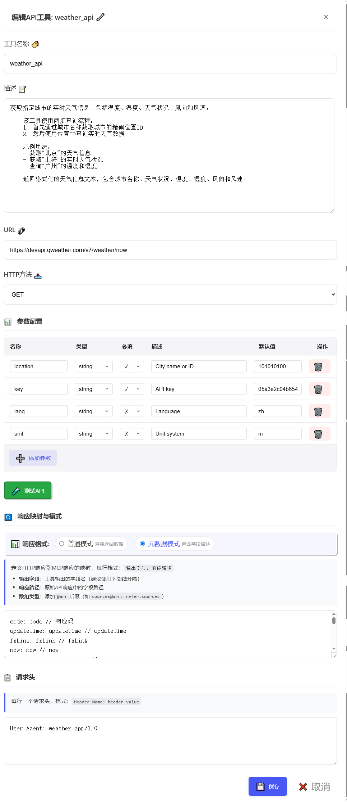
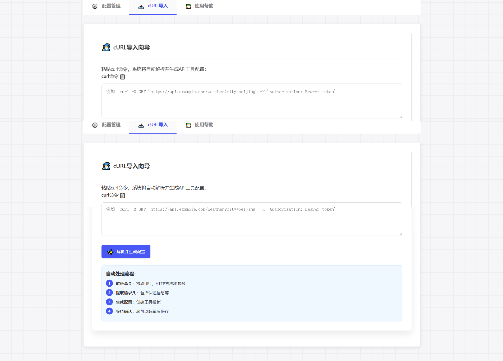
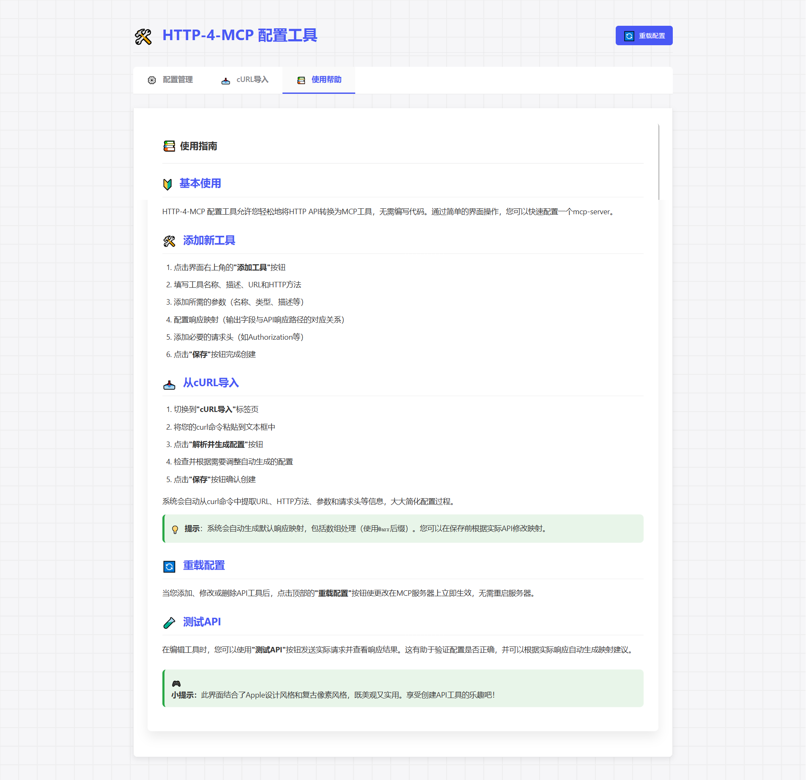

[](https://mseep.ai/app/tght1211-http-4-mcp)

# 🚀 HTTP-4-MCP Middleware Server

<div align="center">


[English](README.md) | [中文](README_CN.md)

</div>

## 🌟 Introduction

HTTP-4-MCP is a powerful middleware server that **magically transforms** regular HTTP interfaces into MCP (Model Control Protocol) interfaces. With simple configuration, your HTTP API becomes an MCP tool instantly!

### ✨ Key Features

- 🔄 **HTTP to MCP**: One-click conversion of HTTP APIs to MCP interfaces
- 📝 **JSON Configuration**: Simple and intuitive configuration
- 🌊 **SSE Support**: Real-time data streaming
- 🎨 **Visual Configuration**: Drag-and-drop interface for API configuration
- 🔥 **Hot Reload**: Instant configuration updates without restart
- 📊 **Complete Monitoring**: Detailed logging and error tracking
- 🛡️ **Secure & Reliable**: Built-in error handling and parameter validation

## 👨‍💻 Author Information

<div align="center">

[](https://github.com/tght1211)
[](https://gitee.com/tght1211)

</div>

## 📸 System Demo

<div align="center">

### 🖥️ Intuitive Visual Configuration Interface



### 🔄 Powerful API Conversion



### 📊 cURL Import Support



### 🚀 Tool Description



</div>

## 🚀 Quick Start

### 📦 Installation

```bash
# Clone repository
git clone https://gitee.com/tght1211/http-for-mcp-server.git
# or git clone https://github.com/tght1211/http-for-mcp-server.git

cd http-for-mcp-server

# Install dependencies (recommended using uv package manager)
uv venv
uv pip install -r requirements.txt
```

### 🎮 Start Service

```bash
# Activate virtual environment
.venv/Scripts/activate  # Windows
source .venv/bin/activate  # Linux/Mac

# Start main server
uv run run.py

# Start configuration UI (optional)
uv run run_config_ui.py
```

## 🎯 Usage Guide

### 1️⃣ Configure API

#### Method 1: 🎨 Visual Configuration (Recommended)

1. Visit `http://localhost:8002`
2. Click "Add New Interface"
3. Fill in configuration parameters
4. Save and apply instantly!

#### Method 2: 📝 JSON Configuration

```json
{
  "tools": [
      {
          "name": "weather_api",
          "description": "Get real-time weather information for a specified city, including temperature, humidity, weather conditions, wind direction, and wind speed.\n    \n    This tool uses a two-step query process:\n    1. First, get the precise location ID through city name\n    2. Then, query real-time weather data using the location ID\n    \n    Example usage:\n    - Get weather information for \"Beijing\"\n    - Get real-time weather conditions for \"Shanghai\"\n    - Query temperature and humidity for \"Guangzhou\"\n    \n    Returns formatted weather information text, including city name, weather conditions, temperature, humidity, wind direction, and wind speed.",
          "url": "https://devapi.qweather.com/v7/weather/now",
          "method": "GET",
          "params": {
              "location": {
                  "type": "string",
                  "desc": "City name or ID",
                  "required": true,
                  "default": "101010100"
              },
              "key": {
                  "type": "string",
                  "desc": "API key",
                  "required": true,
                  "default": "05a3e2c04b65416e912088b76a7a487e"
              },
              "lang": {
                  "type": "string",
                  "desc": "Language",
                  "required": false,
                  "default": "zh"
              },
              "unit": {
                  "type": "string",
                  "desc": "Unit system",
                  "required": false,
                  "default": "m"
              }
          },
          "headers": {
              "User-Agent": "weather-app/1.0"
          },
          "response": {
              "code": {
                  "path": "code",
                  "desc": "Response status code"
              },
              "updateTime": {
                  "path": "updateTime",
                  "desc": "Data update time"
              },
              "fxLink": {
                  "path": "fxLink",
                  "desc": "Detailed weather information link"
              },
              "now": {
                  "path": "now",
                  "desc": "Real-time weather data object"
              },
              "now_obsTime": {
                  "path": "now.obsTime",
                  "desc": "Actual observation time"
              },
              "now_temp": {
                  "path": "now.temp",
                  "desc": "Current temperature (Celsius)"
              },
              "now_feelsLike": {
                  "path": "now.feelsLike",
                  "desc": "Feels like temperature (Celsius)"
              },
              "now_icon": {
                  "path": "now.icon",
                  "desc": "Weather icon code"
              },
              "now_text": {
                  "path": "now.text",
                  "desc": "Weather phenomenon text description"
              },
              "now_wind360": {
                  "path": "now.wind360",
                  "desc": "Wind direction 360-degree angle"
              },
              "now_windDir": {
                  "path": "now.windDir",
                  "desc": "Wind direction description"
              },
              "now_windScale": {
                  "path": "now.windScale",
                  "desc": "Wind scale"
              },
              "now_windSpeed": {
                  "path": "now.windSpeed",
                  "desc": "Wind speed (km/h)"
              },
              "now_humidity": {
                  "path": "now.humidity",
                  "desc": "Relative humidity percentage"
              },
              "now_precip": {
                  "path": "now.precip",
                  "desc": "Precipitation (mm)"
              },
              "now_pressure": {
                  "path": "now.pressure",
                  "desc": "Atmospheric pressure (hPa)"
              },
              "now_vis": {
                  "path": "now.vis",
                  "desc": "Visibility (km)"
              },
              "now_cloud": {
                  "path": "now.cloud",
                  "desc": "Cloud coverage percentage"
              },
              "now_dew": {
                  "path": "now.dew",
                  "desc": "Dew point temperature (Celsius)"
              }
          },
          "response_mode": "metadata"
      }
  ]
}
```

### 2️⃣ Connect to MCP

```python
# SSE connection URL
ws_url = "http://localhost:8000/mcp/sse"
```

## 🛠️ Project Structure

```
📦 http-for-mcp-server
 ┣ 📂 config/            # Configuration files
 ┣ 📂 demo/             # Example code
 ┣ 📂 static/           # Static resources
 ┣ 📜 mcp_server.py     # Main server
 ┣ 📜 config_ui.py      # Configuration UI
 ┣ 📜 run.py           # Startup script
 ┗ 📜 requirements.txt  # Dependencies
```

## 📚 Configuration Reference

### 🔧 Global Configuration

| Configuration | Description | Default |
|---------------|-------------|---------|
| 🌐 host | Server address | "0.0.0.0" |
| 🔌 port | Server port | 8000 |
| 🐛 debug | Debug mode | false |
| 📝 log_level | Log level | "info" |

## 🎉 Special Features

### 🔄 cURL Import

Paste cURL command directly, automatically generate configuration:

```bash
curl -X GET 'https://api.example.com/weather?city=beijing'
```

### 🎨 Pixel Art Interface

- 🎮 Game-like configuration experience
- 🎯 Drag-and-drop parameter setting
- 📊 Real-time request test
- 🔄 Automatically generate configuration

## 🤝 Contribution Guide

1. 🍴 Fork this repository
2. 🔧 Create feature branch
3. 📝 Submit changes
4. 🚀 Push branch
5. 📬 Submit Pull Request

## 📞 Get Help

- 📧 Submit Issue
- 💬 Join Discussion Group
- 📚 View Wiki

## 📄 Open Source License

This project uses the MIT license - see [LICENSE](LICENSE) file

---

<div align="center">
⭐️ If this project helps you, please give a star!⭐️
</div>

